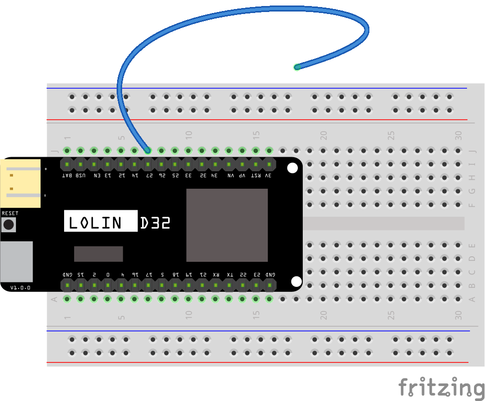
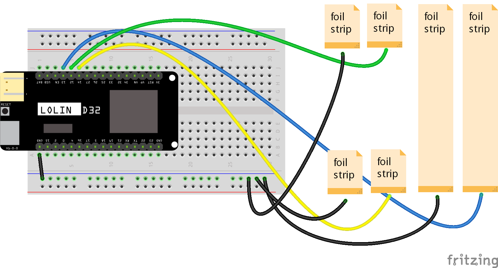

# Project: Hand Sanitiser Level Monitor 

IoT project looking at possible ways to measure level of sanitiser left at sanitiser stations. 

 

## Files and Folders

| File/Folder | Description |
|--- | --- |
|  |  |

 

## Branches

**master**: main branch. currently not using other branches.

 

## Configuration

### MQTT Topics

| MQTT Topic | Description |
| --- | --- |
| hand-sanitiser-levels/ | base topic for project |
| hand-sanitiser-levels/messages | topic for status messages |
| hand-sanitiser-levels/{client-id}/sensor-reading | sensor readings published on this topic as json |
| hand-sanitiser-levels/{client-id}/messages | topic for sending messages to devices |
| hand-sanitiser-levels/{client-id}/messages/led | topic to control on device led. payload should be a string and one of `on`, `off`, or `blink`. |
| hand-sanitiser-levels/{client-id}/messages/poll-interval | topic to set poll interval on device. payload should be an integer. |
| hand-sanitiser-levels/{client-id}/messages/polling-hours | topic to set polling hours on device. payload should be json with following keys: `{'start': start hour, 'end': ending hour}`. hours should be integers. |
|  |  |

### Ports

Some of the docker services are mapped to non-standard ports.

| Port | Service |
|---|---|
| 1883 | MQTT Broker |
| 3000 | Grafana |

 

### Database

| Database | HandSanitiserLevels |
|---|---|
| Tables/Measures | sensor-readings |
| Retention Policies: | 2_weeks (default) |
|  | 4_years |
| Continuous Queries: | cq_1h - `mean(*) INTO 4_years FROM 2_weeks GROUP BY time(60m), *` |

 

## Circuit Diagram - Single Wire
Wire the components as shown in the diagram. Place the other end of the wire on the liquid volume to be measured.

<!--  -->

#### Components Needed
* wire
* ESP32 dev board (Lolin D32)

 

 

### Default Pin Wiring

| Pin No | Function | Device Connection |
| --- | --- | --- |
| 27 | GPIO27/Touch7 | Wire strand |
|  |  |  |

 

## Circuit Diagram - Multi-Point Foil Strips
Wire the components as shown in the diagram. Place the other end of the wire on the liquid volume to be measured.

<!--  -->

#### Components Needed
* wire
* foil tape
* ESP32 dev board (Lolin D32)

 

 

### Default Pin Wiring

| Pin No | Function | Device Connection |
| --- | --- | --- |
| 13 | GPIO13/Touch4 | Full height strip |
| 12 | GPIO12/Touch5 | Top strip |
| 14 | GPIO14/Touch6 | Bottom strip |
|  |  |  |

 

 

## References
