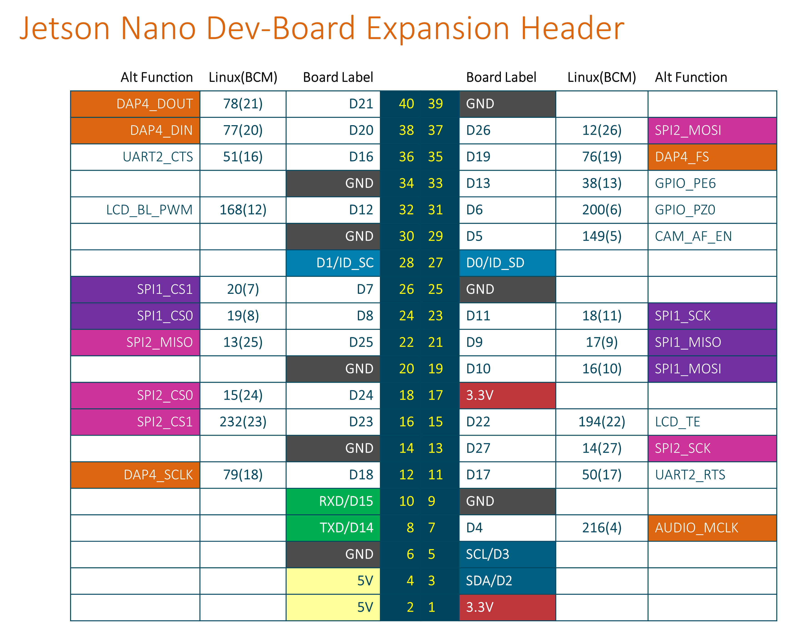

# Starter Project

Template files and folders for starting new IoT projects.

 

## Files and Folders

| File/Folder | Description |
|--- | --- |
|  |  |

 

## Branches

**master**: main branch. currently not using other branches.

 

## Circuit Diagram
Wire the components as shown in the diagram.

#### Components Needed
* 
* 
* connecting wires
* raspberry pi / wemos d1 mini

 

 

### Default Pin Wiring

| Pin No | Function | Device Connection |
| --- | --- | --- |
|  |  |  |

 

## References
