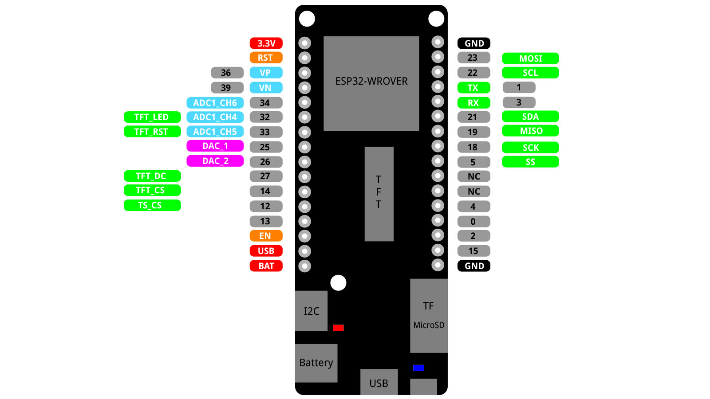

# Project: Hand Sanitiser Level Monitor 

IoT project looking at possible ways to measure level of sanitiser left at sanitiser stations. 

 

## Files and Folders

| File/Folder | Description |
|--- | --- |
|  |  |

 

## Branches

**master**: main branch. currently not using other branches.

 

## Circuit Diagram
Wire the components as shown in the diagram.

#### Components Needed
* 
* 
* connecting wires
* ESP32 dev board (Lolin D32)

 

 

### Default Pin Wiring

| Pin No | Function | Device Connection |
| --- | --- | --- |
|  |  |  |

 

## References
